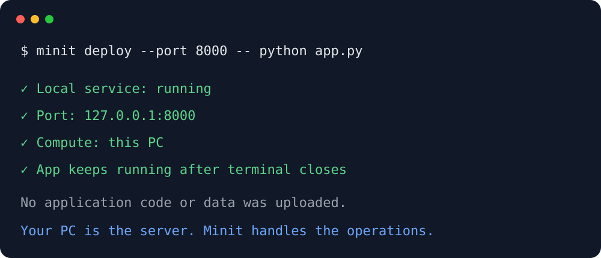

# Minit

**Deploy software to your own computer. Manage it like the cloud.**

> **Your PC is the server.**

Minit is an open-source local-first runtime and management tool for apps built with Claude Code, Codex, Cursor, or any other coding workflow.

AI coding makes it easy to create software locally. Minit is for the next step: **keep that software running on the computer you already own, without moving the app into cloud compute.**

```text
AI builds the app
      ↓
minit deploy
      ↓
your PC keeps it running
      ↓
monitor · restart · version · backup · manage
      ↓
optionally share it with other people
```

**Application code, data, secrets, keys, and compute stay local.** Optional Minit cloud services are for administration, aggregate operational metadata, and encrypted backup storage — not application hosting.



No app upload. No cloud compute required for the app runtime. No separate server to provision.

**Website:** https://junghoonwoo-stack.github.io/minit/

> **Release note:** PyPI `0.1.0` currently provides the temporary `minit run` sharing workflow. Persistent local `minit deploy` and the local manager are on development `main` / `0.2.0.dev0` and are not yet in the stable PyPI release.

## The two modes

### `minit deploy` — keep it running on this computer

Development `main` supports:

```bash
minit deploy --port 8000 -- python app.py
```

Minit starts a detached local supervisor. The terminal can close and the app continues to run **on this PC**.

```bash
minit status
minit logs
minit restart
minit stop
```

The local manager handles health checks, crash restart, CPU/RAM monitoring, local secrets, snapshots/rollback, encrypted data backup, recovery, and user-level autostart.

`minit deploy` means:

> **Keep this app running on my computer.**

It does **not** mean:

> Upload this app to Minit cloud.

### `minit run` — temporarily share what is already running

The stable `0.1.0` release supports:

```bash
minit run --port 8000
```

Minit creates a temporary public URL to an app already running locally. The app process and compute remain on your computer. Stop the command and the temporary public path closes.

## Install

Stable PyPI release:

```bash
pipx install minit-runtime
```

or:

```bash
uv tool install minit-runtime
```

The Python package is named `minit-runtime`; the command is `minit`.

To try the current local-manager development version:

```bash
git clone https://github.com/junghoonwoo-stack/minit.git
cd minit
pip install -e .
```

## Why local deployment?

Small AI-built software often does not need a datacenter. A tool used by 3, 10, or 30 people can often run perfectly well on an existing laptop, desktop, workstation, mini PC, or team machine.

The difficult part is not compute. The difficult part is everything around it:

- keeping the app alive after the terminal closes
- restarting it after failure or login
- monitoring CPU, memory, health, and usage
- handling secrets safely
- recovering from a bad AI edit
- backing up mutable data
- controlling access and connectivity
- managing many small apps without becoming a server administrator

Minit brings those cloud-like operational conveniences **to the local machine**.

```text
Cloud deployment
code → somebody else's compute → managed there

Minit
code → your compute → managed there
```

## Local authority, optional cloud administration

The architecture is intentionally asymmetric:

```text
YOUR COMPUTER
  code
  data
  secrets
  encryption keys
  app process
  local database/files
        │
        │ only allowlisted operational metadata
        │ and already-encrypted backup ciphertext
        ▼
OPTIONAL MINIT CLOUD
  fleet/admin view
  health statistics
  alerts
  blind encrypted backup storage
```

A Minit-operated server should not need plaintext application code, application data, prompts, raw logs, secrets, or decryption keys.

Development `main` includes:

```bash
minit cloud preview
```

which prints the complete cleartext payload currently eligible for cloud administration. See [Cloud Admin Privacy](docs/CLOUD_ADMIN_PRIVACY.md).

## Private by architecture

Minit's target security invariant is:

> **Compromising Minit-operated infrastructure must not be sufficient to read protected app/data/backup content or gain privileged control of the local runtime.**

Remote infrastructure can still be attacked for availability and may observe deliberately retained minimal operational metadata. Minit does not claim complete zero-knowledge guarantees until sandboxing and end-to-end remote-control/connectivity work is implemented and reviewed.

See [Threat Model](docs/THREAT_MODEL.md), [Architecture](docs/ARCHITECTURE.md), and [Product Principles](docs/PRODUCT.md).

## Try the released sharing flow in one minute

In one terminal:

```bash
python -c "from pathlib import Path; p=Path('minit-demo'); p.mkdir(exist_ok=True); (p/'index.html').write_text('Hello from Minit')"
python -m http.server 8000 --directory minit-demo
```

In another terminal:

```bash
minit run --port 8000
```

Open the generated URL from another device.

## Current development focus

The near-term goal is deliberately narrow:

> **Make local app deployment private, simple, and boringly reliable.**

Current work is focused on local sandboxing, real-device persistence/key-store validation, encrypted backup/recovery, privacy-safe administration, and secure connectivity. Remix, marketplace, discovery, and creator monetization are intentionally on hold.

---

# 미닛

**내 PC에 앱을 배포하고, 클라우드처럼 관리합니다.**

> **내 PC가 서버입니다.**

Claude Code, Codex, Cursor 등으로 만든 앱을 굳이 별도 클라우드 서버로 옮기지 않고 **지금 사용하고 있는 컴퓨터에서 계속 실행**하는 것이 Minit의 중심 방향입니다.

```text
AI로 앱 개발
   ↓
minit deploy
   ↓
내 PC에서 지속 실행
   ↓
상태 확인 · 자동 재시작 · 버전 · 백업 · 관리
   ↓
필요하면 다른 사용자에게 공유
```

앱의 **코드·데이터·secret·암호화 key·실행 compute는 로컬**에 남습니다. 선택적인 Minit cloud는 앱을 hosting하는 곳이 아니라 운영 통계 집계와 관리, 이미 암호화된 backup 보관 등을 위한 보조 layer입니다.

현재 PyPI `0.1.0`은 임시 공유 기능인 `minit run`을 제공합니다. `minit deploy`를 포함한 persistent local manager는 현재 `main / 0.2.0.dev0`에서 개발 중입니다.

### `minit deploy`

```bash
minit deploy --port 8000 -- python app.py
```

의 의미는 **“이 앱을 이 컴퓨터에서 계속 실행해줘”** 입니다. Minit cloud로 앱을 upload한다는 뜻이 아닙니다.

Minit은 local process를 background에서 관리하고 health check, crash restart, monitoring, local secret, snapshot/rollback, encrypted backup, recovery, autostart 등을 담당합니다.

### `minit run`

```bash
minit run --port 8000
```

은 현재 실행 중인 local app을 임시 public URL로 공유합니다. compute는 계속 내 PC에 있고, command를 종료하면 공개 경로도 닫힙니다.

## 핵심 구조

```text
내 PC
  코드 · 데이터 · secret · key · 실행
            │
            │ 최소 운영 통계 / 암호문 backup만
            ▼
선택적 Minit Cloud
  admin · 집계 · alert · encrypted backup storage
```

Minit의 목표는 **로컬 앱을 운영하기 위해 발생하는 귀찮은 admin을 없애는 것**이지, 앱을 Minit 서버로 가져가는 것이 아닙니다.

## License

[Apache License 2.0](LICENSE).
